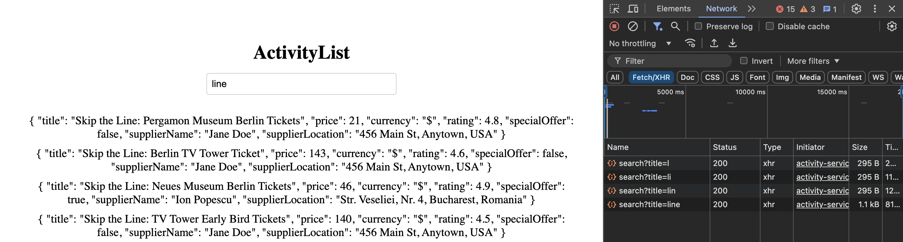

# Technical Design Document

## Activity Search Engine

### Back of the Envelope Estimation

1. **Number of Activities**: 100,000
2. **Number of suppliers**: 20,000
3. **Number of users**: 8,000,000
4. **Active users per day**: (10% of total users) 800,000
5. **Search Queries per day**: Each user makes 10 search queries per day on average (8,000,000 * 10 = 80,000,000)
6. **Search Queries per second**: 80,000,000 / (24 * 3600) ≈ 925 queries per second
7. **Storage**: Assuming each activity record is 1KB, the total storage required for activities is 100,000 * 1KB =
   100MB.
8. **Traffic**: Assuming each search query response is 1KB, the total traffic generated per day is 80,000,000 * 1KB =
   80GB.
9. **Memory**: Assuming each search query response is cached for 1 hour, the total memory required for caching is 80GB.
10. **Latency**: The search engine should respond within 100ms for a good user experience.
11. **Scalability**: The system should be scalable to handle a 2x increase in traffic in the future.
12. **Availability**: The system should be highly available with at least 99.99% uptime.

### Functional Requirements

1. **Search Activities**: Users should be able to search for activities by title.
2. **Display Activity Details**: The search results should display the title, price with currency, rating, whether it
   has a
   special offer or not, the activity's supplier name, and their location.
3. **Filtering Logic**: The application should implement filtering logic to search for activities based on the title.

## Overview

The system is a simple, scalable web application designed to allow users to view and search through a list of
activities. The core components are:

- **Backend Service**: A SpringBoot service that serves as the API layer, handling search and retrieval requests for
  activities from a PostgreSQL database.
- **PostgreSQL Database**: The database stores activity data, and PostgreSQL's Full-Text Search (FTS) capabilities
  enable efficient keyword-based searches on activity titles.
- **Frontend Application**: A VueJS application for displaying the activities list and providing an interactive search
  interface to users.

## Architecture Diagram

Here’s the architectural diagram for this simplified system using Mermaid:

## Components

### API Layer (SpringBoot Backend Service)

The **SpringBoot backend** serves as the core API layer responsible for:

- **Exposing RESTful API Endpoints**: Provides endpoints for querying activities by title and retrieving activity
  details.
- **Search and Filtering Logic**: Uses PostgreSQL’s Full-Text Search to perform keyword-based search queries on the
  title field of activities.
- **Load Balancing**: Multiple instances of the SpringBoot service run behind an API Gateway, distributing the incoming
  load and ensuring high availability.

**Key Considerations**:

- **Horizontal Scaling**: The backend can scale horizontally by adding more instances as needed, managed by the API
  Gateway.
- **Fault Tolerance**: The API Gateway monitors and reroutes traffic to healthy instances in case of failure.

### PostgreSQL Database with Full-Text Search (FTS)

The **PostgreSQL database** handles data storage and search operations for activities. It includes:

- **Activity Data**: Stores activity details, including title, price, rating, supplier information, and location.
- **Full-Text Search (FTS)**: PostgreSQL’s FTS is used to handle text-based queries on activity titles. FTS enables
  efficient indexing and querying of text fields, making it ideal for keyword-based search functionality without
  additional search engines.

**Key Configurations**:

- **GIN Indexing**: A GIN (Generalized Inverted Index) index on the title field enables fast lookups, making search
  operations more efficient.
- **Replication for High Availability**: A read replica of the PostgreSQL database is configured for load balancing read
  operations, ensuring the primary database is not overwhelmed by search queries.

### Frontend Application (VueJS)

The **VueJS frontend** provides a user-friendly interface, displaying activity information and allowing users to search
by title.

- **UI Elements**:
    - **Search Input**: Allows users to input keywords for searching activities.
    - **Activity List Display**: Shows relevant fields (title, price, rating, special offer, supplier name, location).
- **API Integration**: The frontend interacts with the backend API to retrieve activity data and display search results.

---

## Scaling and High Availability

### Backend Scaling

- **Horizontal Scaling**: Additional SpringBoot instances can be spun up as needed to handle increased load. The API
  Gateway distributes incoming requests across available instances.

### Database Replication and Read Load Distribution

- **Primary-Replica Configuration**: PostgreSQL is set up with a primary database for write operations and a read
  replica to handle search requests. This setup reduces the load on the primary database and enhances availability.
- **Failover Strategy**: In case of primary database failure, the read replica can be promoted to primary, ensuring
  minimal downtime.

### High Availability

- **API Gateway**: Ensures the backend remains accessible and load-balanced across multiple instances.
- **Database Replication**: PostgreSQL replication ensures that search operations can continue to run off the read
  replica if the primary becomes temporarily unavailable.

---

## Potential Enhancements

While this design is optimized for current requirements, future enhancements could include:

1. **Caching Layer (e.g., Redis)**: If search volume grows, adding a Redis cache could help offload repeated search
   requests from the database, improving response times.
2. **Search Engine Integration (e.g., Elasticsearch)**: For much larger datasets or more complex search requirements, an
   Elasticsearch layer could be added.
3. **Geolocation Filtering**: If the application requires location-based filtering, additional geo-indexing can be
   implemented.
4. **Auto-scaling**: Dynamic auto-scaling can be set up for both the backend services and the database to handle
   fluctuating loads.
5. **Monitoring and Alerting**: Implementing monitoring tools like Prometheus and Grafana can help track system
   performance and alert on critical issues.
6. **Security Enhancements**: Implementing security measures like rate limiting, authentication, and authorization can
   enhance the system's security posture.
7. **Adding Tests**: Implementing unit tests, integration tests, and load tests can help ensure the system's reliability
   and performance, there will be a need to add tests to ensure the system's reliability and performance.
8. **UI is not good xD**: The UI can be improved to provide a more engaging and user-friendly experience.

---

## Assumptions and Notes

- **Data Size**: We assume the data remains around 100MB, and PostgreSQL can handle this efficiently with proper
  indexing.
- **Search Requirements**: Full-Text Search in PostgreSQL will meet the search performance requirements within the
  assumed data volume.
- **Database Replication**: We assume a single read replica is sufficient for the expected query volume, with the
  ability to add more replicas if needed.

## Screenshots of output

